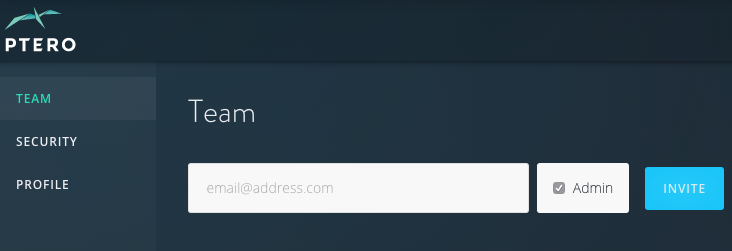
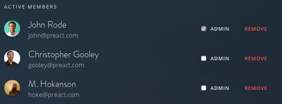
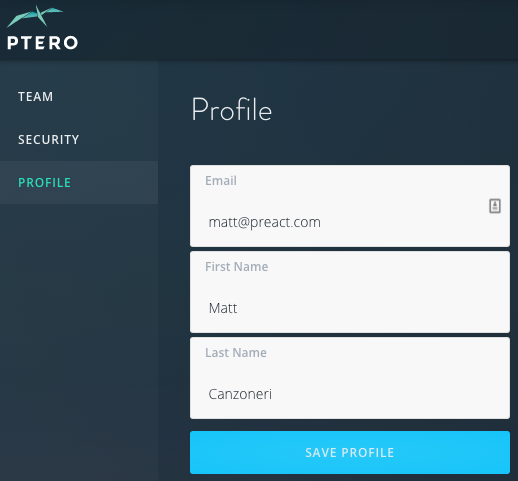
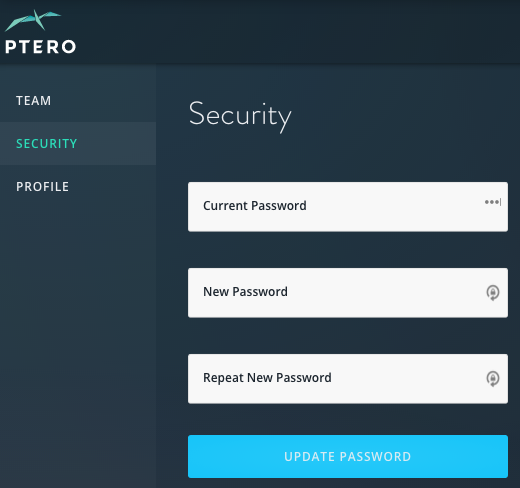

.. _admin-top:

Administration
************************

.. toctree::
  :maxdepth: 2

You can access all of the Ptero administrative features from the Settings icon in the top right of the page. 

Adding & Removing Users
^^^^^^^^^^^^^^^^^^^^^^^^^^^^
You can add or remove users from the Team tab in the Settings. 

To add a new user, simply enter their email address and click Invite. Any user can invite another standard user (non-admin). 

When inviting a new user, there is the option to designate that user as an admin. Abilities available to admins only: 

* Adding, updating, or removing payment information
* Inviting or promoting other admins
* Removing users  

To remove a user or designate as admin (admin only), simply locate the user under the Active Members section and click the corresponding button.  

Changing Profile Info & Password
^^^^^^^^^^^^^^^^^^^^^^^^^^^^
Users can change the name and email address they use to login by going to the Profile section in settings. Simply update the necessary fields and click Save Profile. 

Users can change their password by going to the Security section in settings. Ptero will ask for you to confirm your current password before creating a new password. 

