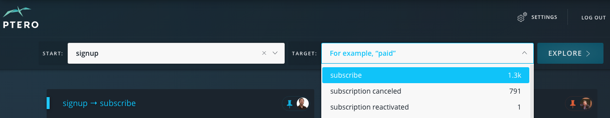
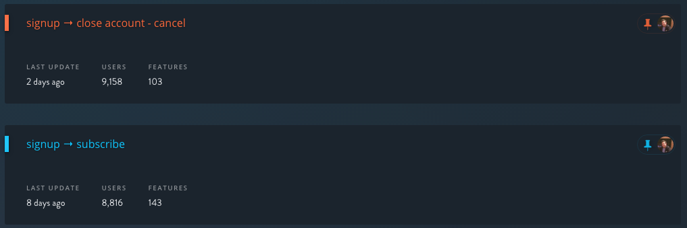
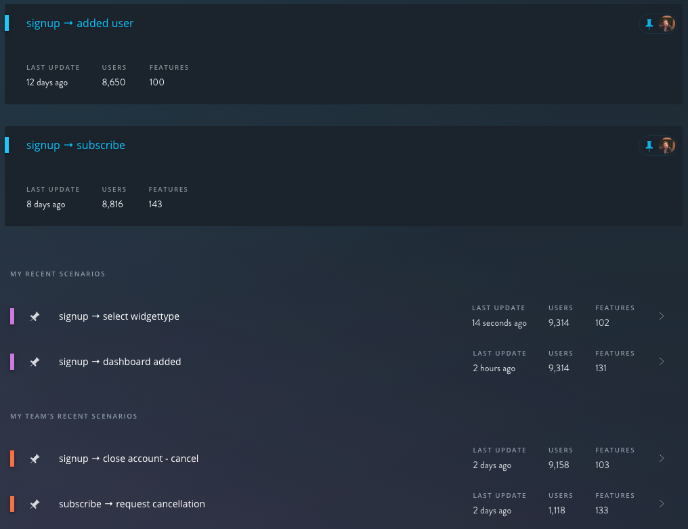

The Dashboard
****************

.. toctree::
	:maxdepth: 2

The Ptero Dashboard is your control panel to create new scenarios, view past scenarios, and organize scenarios.

Creating a New Scenario 
=======================

To create a new scenario, simply choose a **Start Event** and a **Target Event** then click explore. To learn more about scenarios and see some examples, visit the :ref:`What is a Scenario <scenarios-what>` page. 

Organizing Scenarios 
=======================
Once you've created a scenario, it will automatically go into your *My Recent Scenarios* section. Additionally, you can see the scenarios that your team has created in the *My Team's Recent Scenarios* section.

Pinning Scenarios
^^^^^^^^^^^^^^^^^^^^^^

For Scenarios you want to keep front and center, you can pin them to the top of the dashboard by clicking the pin to the left of the Scenario. Pinned Scenarios are shared across your organization, so pinning/unpinning a Scenario from your dashboard will do the same for the rest of your team. Ptero displays the image of the person who pinned a specific Scenario to the right of the highlighted pin icon. 

Changing Color 
^^^^^^^^^^^^^^^^^^^^^^

Ptero also allows you to change the color of a Scenario in order to create groupings. To do this, click on the colored bar to the left of the Scenario name and select a new color. One powerful way to use this functionality is as a way to group scenarios as positive outcomes (blue), negative outcomes (red), or adoption events (pink).

