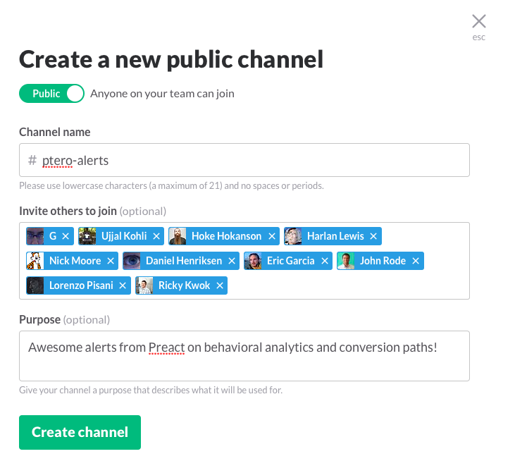
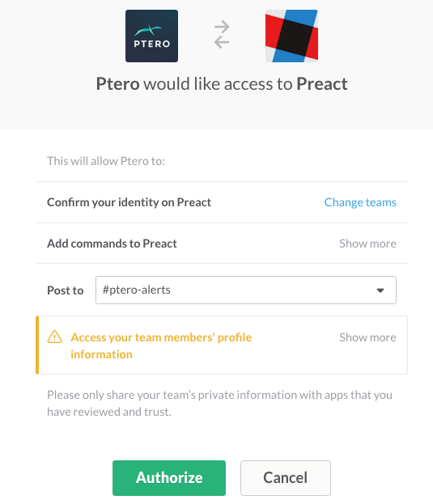
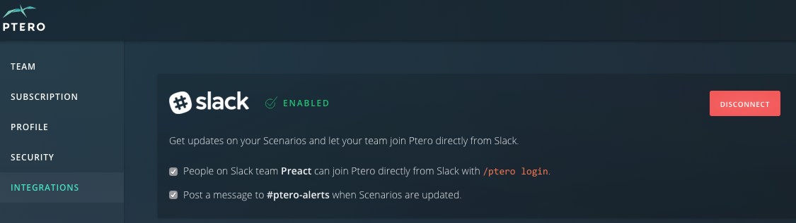

.. _integrations-top:

Integrations
************************

.. toctree::
  :maxdepth: 2

Slack
============================
The Ptero integration for Slack pushes messages to a dedicated channel when scenario results are updated, new scenarios are created, and scenarios are pinned. Never miss important updates and collaborate with your team on analytics in real time! 

Setup
______________________________

1. Create a Slack channel for your Ptero alerts. 
^^^^^^^^^^^^^^^^^^^^^^^^^^^
In Slack, click on the plus sign next to channels to create a new channel. Next, name your channel (may I suggest ptero-alerts) and invite your your coworkers (the more, the merrier). 

2. Connect the Slack integration from your Ptero settings page. 
^^^^^^^^^^^^^^^^^^^^^^^^^^^
In Ptero, click on "Settings" in the top right corner than navigate to "Integrations" from the left pane. Next, click "Add to Slack", select your newly created channel, and authorize. You can disconnect at any time by returning to the "Integrations" section. You will receive a confirmation email and Slack message once the app is connected. 

3. Choose your settings. 
^^^^^^^^^^^^^^^^^^^^^^^^^^^
Ptero is initially configured to send alerts when scenarios are updated and to allow login directly from chat using the /ptero login command. You can disable either of these alerts from the "Integrations" section in Ptero. 

Tips & Tricks
______________________________
* Use the /ptero login command to login directly from Slack. New users will be prompted to create an account if they use the /ptero login command. These new users will be added as a non-admin user. 

* Keep an eye on our blog and docs for new Slack /ptero commands! 