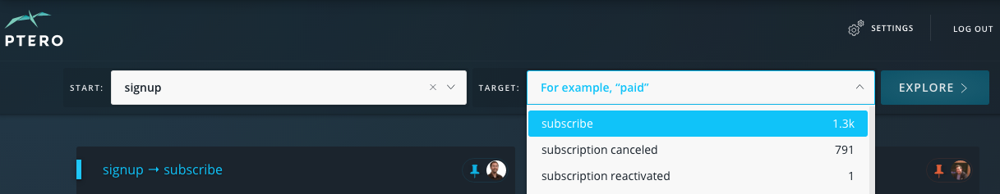
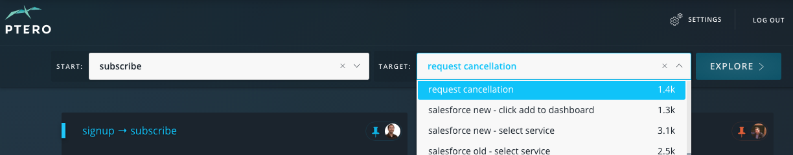

.. _scenarios-what:

What is a Scenario?
****************************

.. toctree::
	:maxdepth: 2

The Ptero *Scenario* is the basic building block of Ptero analyis, so it is important to understand how to create Scenarios and what they encapsulate.

Introduction
================

The *Scenario* answers the question **"What leads from A to B?"**

Frequently, the "from A" part of the question is implied to be "from registration", but Ptero Scenarios allow you to be more explicit.

We call *A* the **start event** because it specifies when we should start to care about users we're trying to nudge along to that target event. The start event may be something simple like a ``registration`` event, but it can be very powerful to use other events as start events.

Finally, *B* can be any event which occurs in your app, game or product and is referred to as the **target event** for the Scenario. For instance, a ``trial-converted`` event would make sense as your target event.

With these example events, you'd have a Scenario to explore "What leads from registration to trial-converted?".

To build any Scenario, you must simply choose a start event and target event. Ptero takes over from there.  

Example Scenarios
======================

Some Scenarios may be about the user acquisition and **conversion** process:

* For a web app with a trial, a scenario from trial start to trial conversion.
* For a fremium app, look at users who register and then later upgraded to a paid plan.
* For a mobile game, look at users who installed the app and then made an in-app purchase.

Or, Scenarios may be about **adoption** of particular features:

* For a chat app, look at users who added friends and then initiated a group chat. 
* For a recipe sharing site, look at users who viewed a recipe and then submitted a recipe.
* For a fantasy sports app, look at users who joined a league and then voted on a trade.

Furthermore, you can create Scenarios with "bad" events as target events. This would allow you to understand the behaviors which lead to churn or cancellations.

